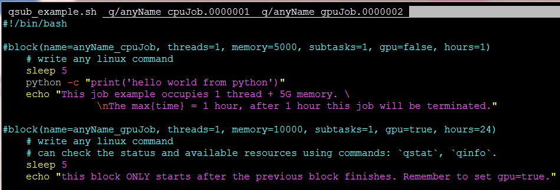
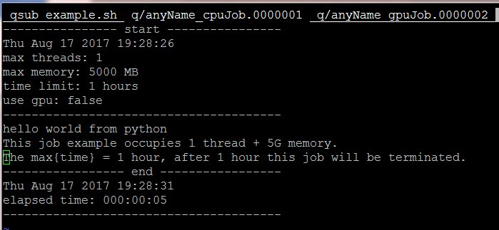
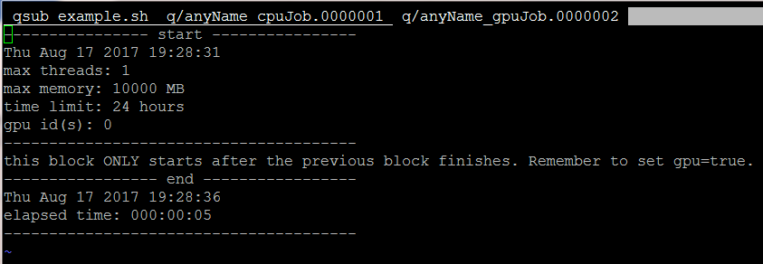

# Luvision  ;-)
* This repo includes some information only for luvision members. 
* [contribute]: If you want to open an account or to add more information to this doc, please contact Mengqi or directly pull a request. 

## content
* [Server and Fileserver](#Servers-and-fileserver), read before using the servers. 
* [Scheduling Tool](#Scheduling-Tool), read before running any code on the server.  
* [Reimbursement in TBSI](#Reimbursement-in-TBSI), 清华伯克利报销

## Servers and fileserver

* Keep in mind: 
    - **nerver** use luvision account to run code on the server. Please use **your own account and the queuing tool to submit jobs**. Otherwise, you may terminate someones’ running jobs. 
    - **luvision account is the only superuser**, and can only be used to install publicly used libraries, which may has different versions, such as cuda 7.0/8.0/…. Specify the version you want use in your local account `.bashrc` / `.theanorc` / … So that evryone’s setting will not affect others’. 
    - If you want to open an account or to add more information to this doc, please contact **Mengqi**.

* Server: 
    - `ssh <userName>@svr1.local`  # or svr2
        * if doesn't work --> use NAT IP address: `ssh <userName>@10.8.5.246`  # or 248 for sever 2 
    - Using **WLAN IP** to **access from outside of TBSI**: `ssh <userName>@58.250.23.197` # or 195 for server 2
    - open accounts: since the servers share the file system, please make sure the newly added users have the same userID and groupID on the servers. 
        * If you want to use both the servers and your local machin in TBSI, in order to make your life easier please make sure that your userID and groupID on your local machine are consistent with the ones on the servers.
    - Server arrangement

| name  | IP         | users                                 |
| ----- | ---------- | ------------------------------------- |
| svr1  | 10.8.5.246 | haitian    & weifeng     &            |
| svr2  | 10.8.5.248 | mengqi     & wangyong    &            |
| ----- | ---------- | ------------------------------------- |
| svr10 | 10.8.4.130 | lhanaf     & weifeng     &            |
| svr11 | 10.8.4.129 | wangyong   & chengwei    & wangdan    |
| svr12 | 10.8.4.132 | wangdan    & zhuyinheng  &            |
| svr13 | 10.8.4.133 | mengqi     & tanyang     &            |
| ----- | ---------- | ------------------------------------- | 
| svr20 | 10.8.4.140 | chengwei   & jinzhi      & tanyang    |
| svr21 | 10.8.4.141 | zhuyinheng & jinzhi      &            |
| svr22 | 10.8.4.142 | haitian    & yaping      &            |
| svr23 | 10.8.4.143 | lhanaf     & yaping      &            |

* Fileserver: 
    - Because of the security issue of the curlftpfs / samba / … , we only enable NFS on the fileserver. Don't enable other mount methods. 
    - The **/fileserver** folder is mounted from the fileserver, you can use that folder to share data between servers and your local machine. 
    - You'd better make a symbolic link in your home directory 
        * `mkdir /fileserver/<userName>`
        * `ln -s /fileserver/<userName> /home/<userName>/fileserver`  # then you can access the fileserver using the address `~/fileserver`
        * The fileserver is large enough to do what you want. **Do not** put too large files in your home directory except `~/fileserver`.

* `apt-get` without sudo 
    - `apt-get download tmux` # get the .deb file 
    - `ar x tmux*.deb` # extract the contents 
    - `tar xvzf data.tar.gz` # the file data.tar.gz has all the stuff which you need for executing the software 
    - `./usr/bin/tmux` # ./usr folder can be moved to other directory for convinience 
    - add `/home/<userName>/usr/bin/` to PATH, add to the end of `~/.bashrc` and source it. 
    - can directly use command tmux 

* mount remote folder (say, /home/mengqi/ on <IP>)  over sshfs on your local machine (say, ~/remoteDir)
    - `sudo apt-get install sshfs && sudo modprobe fuse && mkdir ~/remoteDir && sshfs <userName>@<IP>:/home/mengqi/ ~/remoteDir && cd ~/remoteDir`
 
* [cuDNN without sudo (in your home folder)](https://github.com/mjiUST/driver_cuda_cudnn#cudnn-without-sudo-in-your-home-folder-2)
* basic tutorial of vim & tmux & zsh: [fast way to setup working environment (vim+tmux+zsh)](https://github.com/mjiUST/vim_tmux_zsh)
* If you are still using Windows:
    - use sshfs on your OWN windows: [download](https://win-sshfs.googlecode.com/files/win-sshfs-0.0.1.5-setup.exe) (or download from the `<git_repo>/software` folder), and enter ssh information and the drive letter (say, G:) you would like Windows to use for your droplets file system
    - use [putty](https://the.earth.li/~sgtatham/putty/latest/w64/putty.exe) to ssh. use [pscp](https://the.earth.li/~sgtatham/putty/latest/w64/psftp.exe) to copy file between windows and Linux
    - or you'd better change to Linux.

## Scheduling Tool
* Keep in mind:
    - nerver use luvision account to run code on the server. Please use your own account and this queuing tool to submit jobs. Otherwise, you may terminate some running jobs.
    - Should you have any queries, please contact Mengqi.

* About
    - we use it to schedule our jobs on the jointly used computers.
    - Jobs are scheduled according to a priority queue. The priority of a job is small if the amount of requested resources/computation time is large. Priority of a job increases with its waiting time. 
    - For the latest version and professional usage, please check the author’s [github](https://github.com/alexanderrichard/queueing-tool).
    - Check the samples in [<this_git_repo>/code/queuing_samples](https://bitbucket.org/mjiUST/luvision_userguide/src/master/code/queuing_samples/)
* Check the **available** resources:
    - `qinfo`:  

* How to submit jobs (`qsub xxx.sh`):
    - The queue uses bash scripts that are organized in blocks. A block is a part of the script that forms an independent job and can be specified as follows, in the file `qsub_example.sh`:

    - `qsub qsub_example.sh` to submit the jobs. Each task’s printout will be stored in the `./q.log` folder.
* How to check the status of the queued jobs:
    - `qstat`: check the current status of queued jobs on this machine. The output for the previous submitted job in the FIRST 5 seconds. **Note** that the anyName_gpuJob was in the `h: hold` status and there was no gpu occupied in the first 5 seconds. 

    - the status in the last 5 seconds:

* Check the log files
    - the name of the log files follow the `jobname`+`id`:

* Delete your jobs:
    - `qdel id1, id2, ...`

* Have fun!
 
 
## Reimbursement in TBSI

* 所有票据：
    - 每个票／说明上都需要签字（直接签在发票正面，不可用铅笔）
    - 大于一千的票：付款记录（最好有姓名／交易编号等信息）
    - 将名字／身份证／银行帐号／分行信息写到一张贴纸上（一份就好）

* 差旅相关：
    - 机票：行程单 + 信天游机票验伪截图并打印
    - 住宿：
    - 打车票
    - 其他票据（如携程邮寄发票的邮费差额发票）
    - 说明：（并签字）
        * 如机票不是闭环 或 没有住宿，必须写说明并签字
        * 列明各项花销：机票价格 / 住宿价格 / 打车费用 / 其他费用

* 实验器材／办公用具发票：
    - 抬头：清华-伯克利深圳学院筹备办公室  (recheck with **Xiongfei**!!!)
    - 纳税人识别号：1244030035002941X2  (recheck with **Xiongfei**!!!)
        * 地址：深圳市南山区学苑大道1001号南山智园
        * 电话：86244273
        * 开户行：建设银行深圳后海公馆支行
        * 账号：44201018600052503993
    - 需有购物清单
    - 电子发票打印亦可
    - 外币购买：需列出转换成人民币的汇率和金额 
